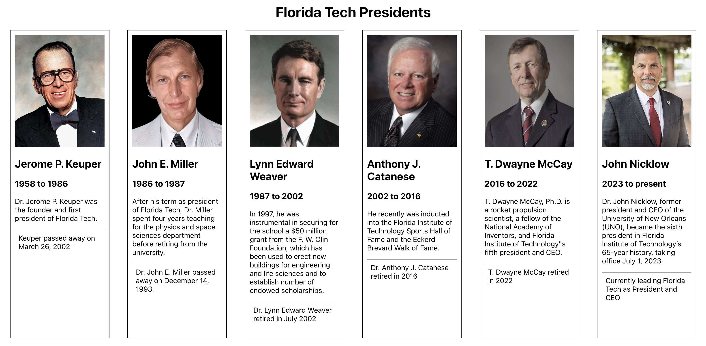

# Web Applications at Forida Tech
## React Demos by Dr. Fitz aka FitzReacts
### Project: fitpresidents
This repository holds sample code for a react project that uses cards to display information about presidents of Florida Tech.

Code written by Dr. Fitz

**To use this code, make sure node is installed**

* Next, choose a location for your project and enter the following:
* `npm create vite@latest fitpresidents -- --template react`
* Download the src files from this repository and place them in the appropriate directory
* Add the dataset named fitpresidents.js provided by the instructor
* Create a CSS file and style your HTML to resemble the following:
* 
* Enter `npm install` to install the packages in your package.json file
* Enter `npm run dev` to test the application

